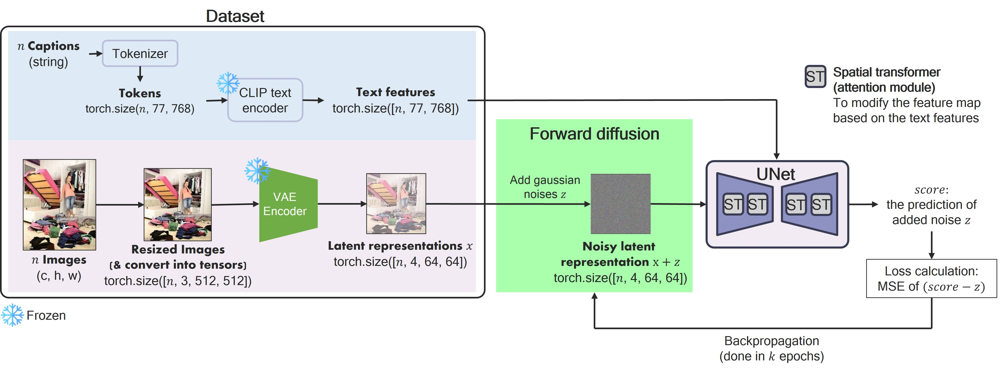

# Text-to-Image-Stable-Diffusion-Example



This notebook contains code of the toy code of stable diffusion. This notebook is made for students of Vision Language Intelligence Lab, Sejong Univeristy.

## Requirements
A suitable conda environment named 'stable_diffusion' can be created and activated with:
```
conda create --name stable_diffusion
conda activate stable_diffusion
```

You can also install the dependencies:
```
pip install einops
pip install lpips
pip install git+https://github.com/openai/CLIP.git
pip install transformers
pip install diffusers==0.11.1
pip install accelerate
pip install tensorboard
pip install --upgrade ipywidgets
pip install --upgrade jupyter ipywidgets
jupyter nbextension enable --py widgetsnbextension
pip install matplotlib
pip install accelerate
pip install yacs
pip install easydict
pip install torch==1.12.1+cu113 torchvision==0.13.1+cu113 -f https://download.pytorch.org/whl/torch_stable.html
pip install gdown
pip install scipy ftfy
```
## The scheme of the [toy_code_stable_diffusion_full.ipynb](https://github.com/Sejong-VLI/Text-to-Image-Stable-Diffusion-Example/blob/main/Toy_code_stable_diffusion_full.ipynb) notebook:

### Preliminaries
- Install dependencies
- Import libraries
- Set the GPU

### Dataset preparation
- Download the dataset
- Image feature extraction
- Text feature extraction
- Load preprocessed features

### Modelling
- Preliminaries function for UNet
- Attention architecture
- UNet architecture

### Training
- Loss function
- Training loop

### Inference
- Sampler module (reverse diffusion module)
- Sampling loop
- Stable diffusion original
